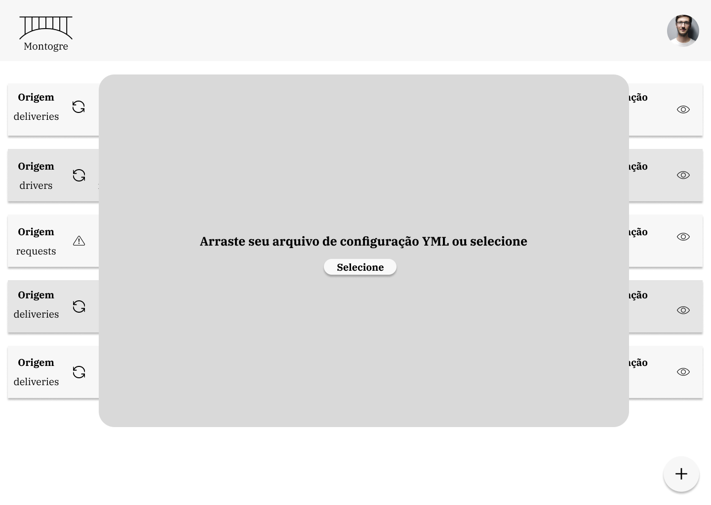

# Projeto de Estudo - Montogre (1.0.0)

## Cliente Fictício

**Nome do Cliente Fictício:**

TransportLogistics Inc.

**Descrição do Cliente Fictício:** 

A TransportLogistics Inc. é uma empresa que está crescendo no setor de transportes, especializada em logística e entrega de mercadorias em todo o país. Com uma frota extensa de veículos equipados com sensores avançados, a empresa coleta uma ampla variedade de dados em tempo real, incluindo localização, condições de carga e status de entrega.

Atualmente, a empresa armazena todos esses dados em um banco de dados MongoDB altamente eficiente. No entanto, eles enfrentam um desafio crítico: a necessidade de criar dashboards e realizar análises de dados abrangentes sobre o desempenho de suas entregas e logística. Embora o MongoDB seja excelente para armazenar esses dados em tempo real, sua estrutura não é ideal para a criação de análises e relatórios avançados, o que dificulta a obtenção de insights cruciais.

Para superar esse desafio, a TransportLogistics Inc. deseja iniciar um projeto para sincronizar e migrar esses dados do MongoDB para um banco de dados PostgreSQL, que é mais adequado para integração com ferramentas de Business Intelligence (BI)

**Necessidades e Requisitos do Cliente:** 

- Migração de Dados:
  - A capacidade de migrar dados de coleções específicas do MongoDB para tabelas correspondentes no PostgreSQL. O usuário deve poder indicar de qual coleção MongoDB deseja extrair dados.
  
- Seleção de Campos:
  - A capacidade de selecionar campos específicos de documentos do MongoDB para serem carregados no PostgreSQL. Isso permitirá que os usuários escolham quais dados são relevantes para suas análises.

- Variação nos Tipos de Dados de Campos:
    - A capacidade de lidar com a variação de tipos de dados, dado que a variedade de sensores resulta em inputs de tipos e formatos variados. (Exemplo: Uma data pode vir em formato de string ou uma informação pode vir em um elemento composto se encontrando de forma aninhada)

- Registro de Última Sincronização:
  - Manter um registro da data e hora da última sincronização bem-sucedida dos dados entre MongoDB e PostgreSQL. Isso garantirá que os dados estejam sempre atualizados.

- Tempo Médio de Sincronização:
  - Fornecer informações sobre o tempo médio necessário para concluir o processo de sincronização. Isso ajudará a avaliar o desempenho do processo e a estimar o tempo necessário para futuras sincronizações.

- Quantidade de Dados Sincronizados:
    - Fornecer informações sobre a quantidade de dados carregados.

## Escopo do Projeto

### Visão Geral do Produto

- **Descrição do Produto:** 
Este projeto representa um sistema de Extração, Transformação e Carregamento (ETL) de dados projetado para atender às necessidades da TransportLogistics Inc., uma empresa do ramo de transportes. O sistema permitirá a extração de dados de coleções específicas do MongoDB e a transformação desses dados de acordo com os requisitos do usuário antes de carregá-los em tabelas correspondentes em um banco de dados PostgreSQL. Os usuários terão a capacidade de definir quais campos devem ser extraídos, bem como as transformações a serem aplicadas a esses dados. Além disso, o sistema manterá um registro da data e hora da última sincronização bem-sucedida entre os bancos de dados. Em resumo, o projeto representa uma solução ETL personalizável para facilitar a análise de dados sobre o desempenho de entregas e logística.

- **Benefícios Esperados:**
  
  Com a entrega deste projeto ETL, a TransportLogistics Inc. espera alcançar os seguintes benefícios:

  - Melhorias na capacidade de análise de dados para otimizar a logística de entregas.
  - Acesso mais fácil a dados relevantes para tomada de decisões informadas.
  - Redução do tempo gasto na preparação de dados para análise.
  - Aumento da eficiência operacional e melhoria na qualidade das entregas.
  - Capacidade de integrar os dados coletados com ferramentas de Business Intelligence (BI) para criar dashboards e relatórios avançados.

- **Usuários Principais:**
  
  Os principais usuários deste projeto ETL incluem:

  - Equipe de análise de dados da TransportLogistics Inc. responsável por criar análises e relatórios avançados.
  - Administradores de sistemas encarregados de configurar e monitorar o processo ETL.
  - Gerentes e tomadores de decisões que utilizarão as análises geradas para otimizar a logística de entregas e melhorar o desempenho operacional da empresa.
 
- **Protótipos Básicos de Telas:**

  - Inicialmente se espera uma visão básica das operações em andamento com as seguintes informações:

    - Origem (_Nome da coleção de origem_)
    - Status da operação
    - Destino (_Nome que terá dentro do banco Postgre_)
    - Última data de atualização
    - Ultima data de sincronização
    - Tempo médio de sincronização

   **_Exemplo:_**
  
    

  - Incialmente as configurações que vão indicar a origem e destino dos dados bem como seu devido tratamento poderá ser fornecido via um arquivo (_.YML sugestão_) e posteriormente ser desenvolvida uma interface que permita o usuário cadastrar diretamente as configurações.
  
   **_Exemplo:_**

  

  **_Simulação:_**

  

### Requisitos Funcionais

- Descritos no Jira.

### Requisitos Não Funcionais

- Definir

### Restrições e Dependências

- Definir

### Cronograma

- Definir

### Equipe de Desenvolvimento

- Definir

### Considerações de Qualidade

- Definir

